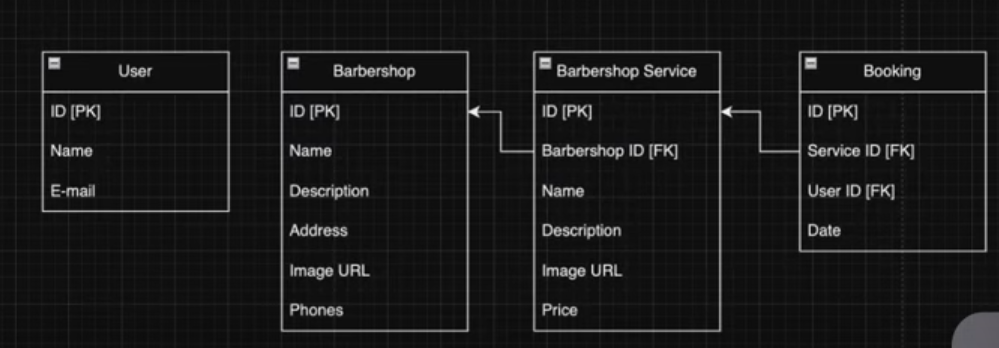
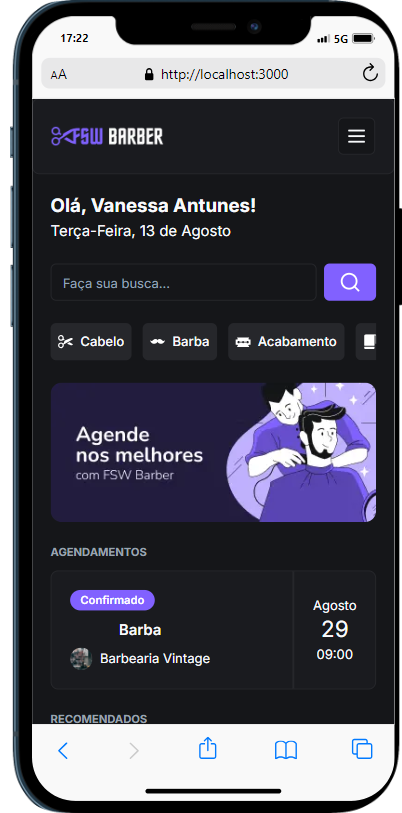
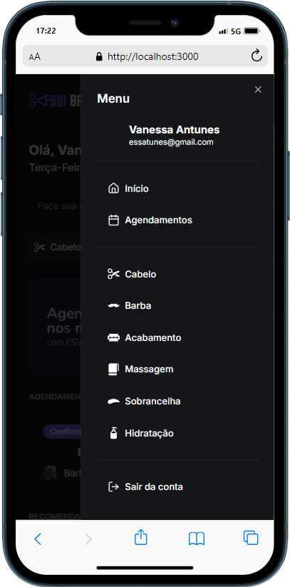
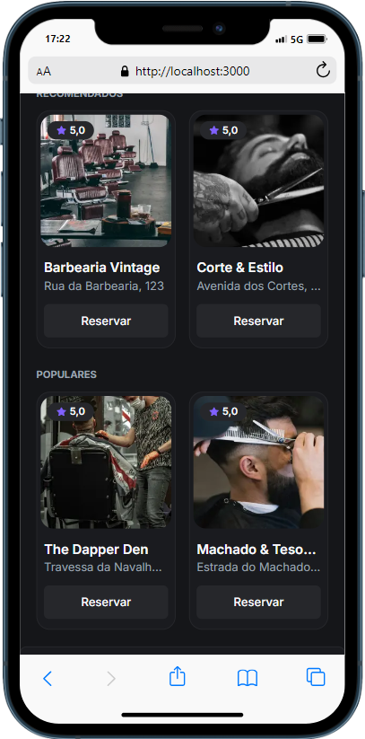
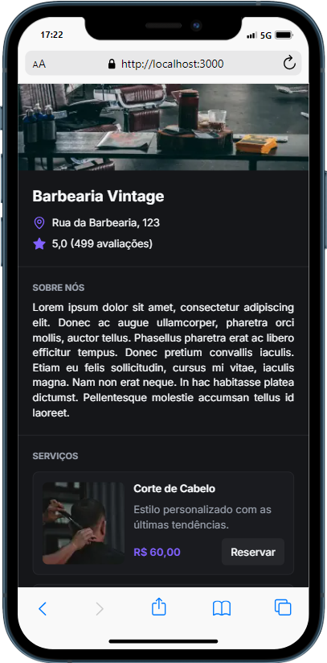
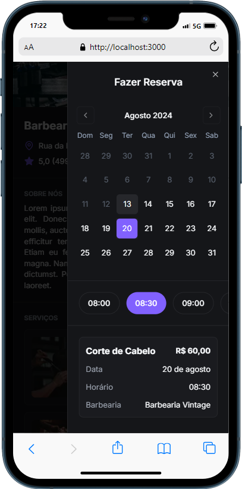
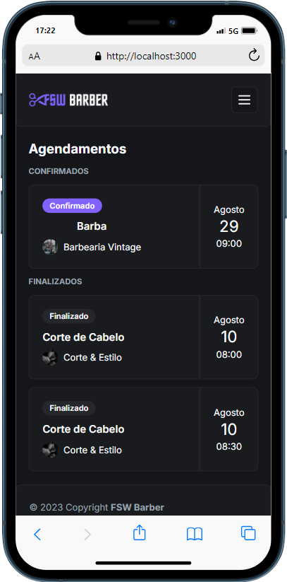
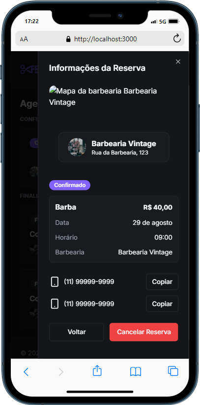

# Projeto FSW Barber realizado no evento da [Full Stack Week](https://fullstackclub.com.br/fsw5/?utm_source=youtube&utm_medium=organic&utm_campaign=Full_StackClub_05_2024_lancamento_Quente_Lead&utm_term=Live&utm_content=) com [Felipe Rocha](https://www.youtube.com/@dicasparadevs)

Diagrama:

Projeto de Barbearias completa com agendamentos de serviços, login do google, sistema de reserva de serviço com horários e dias disponiveis, cancelamento do agendamento

| |  |  |
|:----------------------------------------:|:----------------------------------------:|:----------------------------------------:|
|  |  |  |
| 
 | &nbsp; | &nbsp; |

#### Tecnologias ultilizadas

- **Next.js**
- **React.js**
- **PostgreSQL**
- **Tailwind CSS**
- **Prisma**
- **Node.js**
- **ShadCN**
- **TypeScript**
- **JavaScript**
- **Neondb**

